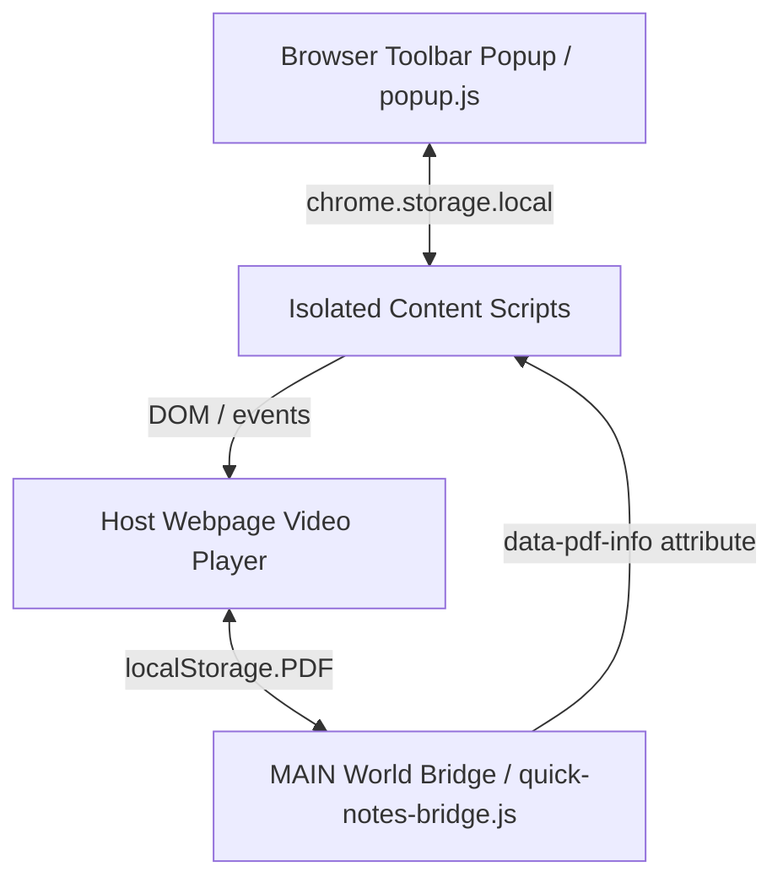

# Contributing to Video Speed HUD & Question Time Watcher

Thank you for your interest in contributing! This guide outlines the project architecture, data schemas, coding guidelines, and workflows to help you build and test features for the extension.

---

## 🛠️ Project Architecture & Execution Worlds

The extension is built on **Manifest V3** and runs in two distinct contexts (worlds) to balance features and security:



### 1. Isolated Execution World (Default Content Scripts)
Most files in `src/core/` (e.g., `speed-controller.js`, `question-timer.js`, `silence-skipper.js`, `study-tracker.js`, `quick-notes.js`) execute in the browser's isolated content script sandbox.
* **Capabilities**: Direct access to the DOM, standard page events, and the `chrome.storage` API.
* **Limitations**: Cannot access the host webpage's Javascript window variables or its site-specific `localStorage` due to Content Security Policies (CSP).

### 2. MAIN Execution World (Page Context Bridge)
The `src/core/quick-notes-bridge.js` file is loaded explicitly with `"world": "MAIN"` in the manifest.
* **Capabilities**: Can read the host page's environment variables and raw `localStorage` (such as the `PDF` notes source).
* **Communication**: To pass this data to the isolated world, the bridge serializes it into a custom HTML attribute `data-pdf-info` on `document.documentElement`, which the isolated script `quick-notes.js` monitors using a `MutationObserver`.

---

## 💾 Chrome Local Storage Schema

All extension data is stored in `chrome.storage.local`. Please keep the following data structures intact when updating storage logic:

### 1. Per-URL Question Timer Logs (`qt_log_[encodedUrl]`)
* **Key**: `'qt_log_' + encodeURIComponent(cleanUrl)` (where `cleanUrl` excludes the hash `#` component).
* **Value**:
  ```typescript
  interface QuestionTimerSession {
    url: string;
    currentQuestionNum: number;
    elapsedTime: number; // In-progress stopwatch time (ms)
    isRunning: boolean;
    startTime: number; // Timestamp of start/resume
    logs: Array<{
      qNum: number;
      durationSec: number;
      timeFormatted: string;
      targetSec: number; // 0 if benchmark disabled
      isOnTime: boolean;
    }>;
    isMinimized: boolean;
    isHidden: boolean;
    isClickThrough: boolean;
    posLeft: string | null; // CSS left position
    posTop: string | null;  // CSS top position
    lastUpdated: number;    // Date.now() timestamp
  }
  ```

### 2. Daily Study Progress (`studyTrackerData`)
* **Key**: `studyTrackerData`
* **Value**:
  ```typescript
  interface StudyTrackerData {
    dailyGoalHours: number; // e.g., 6.0
    streakDays: number;     // Active day streak
    lastActiveDate: string; // YYYY-MM-DD
    history: {
      [dateString: string]: { // YYYY-MM-DD keys
        realSec: number;     // Actual study time elapsed
        coverageSec: number; // Playback rate adjusted time covered
        questionSec: number; // Time spent solving questions
        platforms: {
          [platformName: string]: number; // Platform-specific second tracking
        };
      };
    };
  }
  ```

---

## 📋 Coding Guidelines & Standards

### 🛡️ Guard Against Extension Context Invalidation
When an extension is updated or reloaded in Developer Mode, existing tabs run into an "Extension context invalidated" error on subsequent Chrome API calls.
* **Rule**: Wrap Chrome storage accesses in try/catch blocks and always check for context validity before calling storage functions. Use the helper:
  ```javascript
  function isContextValid() {
    try {
      return typeof chrome !== 'undefined' && chrome.runtime && !!chrome.runtime.id;
    } catch (e) {
      return false;
    }
  }
  ```

### ⌨️ Respect Interactive Form Controls
Content scripts must not intercept keyboard hotkeys when a user is actively typing in a text field, input, or editing panel.
* **Rule**: Insert this guard block at the beginning of all document keydown/keyup event handlers:
  ```javascript
  const active = document.activeElement;
  if (
    ['INPUT', 'TEXTAREA'].includes(active?.tagName) ||
    active?.isContentEditable
  ) {
    return;
  }
  ```

### 🧬 Prevent Namespace Pollution
Keep global scope clean. Every script must be encapsulated in an Immediately Invoked Function Expression (IIFE) with `'use strict';` enabled.
```javascript
(function () {
  'use strict';
  // Module code here...
})();
```

### 🌿 Support Single Page Applications (SPA)
Many modern lecture platforms use React, Vue, or Next.js (client-side routing) which do not trigger full page load events when navigating.
* **Rule**: Use a periodic interval or a `MutationObserver` to monitor DOM changes or URL changes to automatically re-bind event listeners or attach badges to dynamic `<video>` players. See `remaining-time.js` and `question-timer.js` for examples.

### 🚀 Performance & Styling
* **No External Dependencies**: Write clean, vanilla JS. Avoid importing jQuery, Lodash, or large utility libraries.
* **Separation of Styles**: Do not use inline CSS strings inside Javascript files. Write style declarations inside `src/styles/hud.css` or scoped stylesheets and apply them via class toggles.

---

## 🎯 Creating Site-Specific Plugins

To add optimizations or keyboard shortcuts for a specific platform (similar to `pw-enhancements.js`):

1. **Create the Script**: Create a new file under `src/plugins/your-plugin.js`.
2. **Create Scoped CSS**: If layout tweaks are required, add `src/styles/your-plugin-custom.css`.
3. **Register in `manifest.json`**: Add a new match block under `content_scripts`:
   ```json
   {
     "matches": ["*://*.yourplatform.com/*"],
     "css": ["src/styles/your-plugin-custom.css"],
     "js": ["src/plugins/your-plugin.js"]
   }
   ```

---

## 🚀 Testing & Debugging Workflow

### 🔍 Inspecting Logs
* **Content Scripts (HUD, Speed, Timer)**: Press `F12` inside the lecture page and inspect the standard page Console.
* **Popup Dashboard**: Right-click the extension icon in the toolbar, select **Inspect popup**, and view the developer console.

### 💾 Inspecting local storage
To view active storage data directly, you can run the following command in the Console of your page:
```javascript
chrome.storage.local.get(null, data => console.log(data));
```

Thank you for contributing to make video learning faster and more productive for everyone! ❤️
