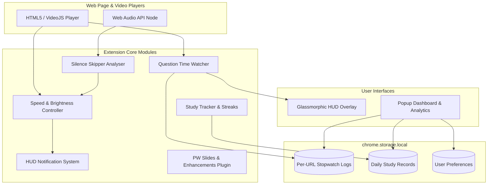

# 🎥 Video Speed HUD & Question Time Watcher

<p align="center">
  
</p>

<p align="center">
  <strong>An ultra-lightweight, feature-packed browser extension for precision video playback control, real-time HUD overlays, intelligent silence skipping, and exam pace stopwatch tracking.</strong>
</p>

<p align="center">
  <a href="https://github.com/Fire162/PW-extension/releases"></a>
  <a href="https://developer.chrome.com/docs/extensions/"></a>
  <a href="https://www.chromium.org/"></a>
  <a href="LICENSE"></a>
</p>

---

## ⚡ Overview

**Video Speed HUD & Question Time Watcher** is an open-source productivity extension engineered for online students, competitive exam aspirants, and power video consumers. Built on Manifest V3, it seamlessly injects into web video players (including PhysicsWallah, YouTube, Coursera, standard HTML5, and VideoJS players) to provide frictionless speed micro-adjustments, automatic dead-air skipping via the Web Audio API, and an interactive glassmorphic question timer.

---

## ✨ Key Features

### ⚡ Playback & Environmental Controls
* **Precision Speed Micro-Adjustments**: Fine-tune video playback speed from **0.25x up to 4.0x** using <kbd>Alt</kbd> + **Scroll** or <kbd>Alt</kbd> + <kbd>←</kbd> / <kbd>→</kbd> in fine **0.05x** increments.
* **Speed Ramping (Progression Mode)**: Toggle with <kbd>Ctrl</kbd> + <kbd>/</kbd> to gradually accelerate video speed by `+0.1x` in scaling intervals (`waitTime = currentStep * 20` seconds) up to `2.5x` maximum.
* **Instant Hold Fast-Forward**: Hold <kbd>Spacebar</kbd> (for `> 250ms`) to temporarily accelerate playback to **2.0x**. Releasing restores your exact speed; quick tap toggles standard Play/Pause.
* **2x Speed Toggle**: Press <kbd>S</kbd> to instantly jump to **2.0x** playback speed. Press <kbd>S</kbd> again to restore your exact previous speed — a quick one-key toggle for rapid fast-forwarding.
* **Remaining Time Badge**: Toggle with <kbd>R</kbd> to display real remaining video time alongside speed-adjusted time (e.g. `-10:00 | 05:00 at 2.0x`).
* **Screen Brightness Overlay**: Adjust video brightness from **0.3x to 2.5x** using <kbd>Alt</kbd> + <kbd>↑</kbd> / <kbd>↓</kbd>.

### ⏱️ Question Time Watcher (Stopwatch HUD)
* **Glassmorphic Floating Widget**: A translucent, liquid-glass widget docked on the video container so behind-player content remains readable.
* **Exam Pace Benchmark ("Beat the Clock")**: Cycle target pacing benchmarks (**1m / 2m / 3m / 5m**) with <kbd>Alt</kbd> + <kbd>B</kbd>:
  * 🟢 **Green Glass Glow**: Time spent $\le$ 70% of benchmark.
  * 🟡 **Yellow Glass Glow**: Time spent between 70% and 100%.
  * 🔴 **Red Glass Glow (Overtime)**: Time spent exceeds benchmark limit.
* **Smart Auto-Timer**: Automatically starts timing when you pause a video to solve a problem and logs laps when playback resumes.
* **Click-Through Mode**: Toggle with <kbd>Alt</kbd> + <kbd>C</kbd> or click 🎯 to pass clicks directly through the widget onto underlying video player controls.
* **Per-URL Persistence**: Stopwatch status, logs, widget positions, and minimized states are stored in `chrome.storage.local` indexed by URL.

### ⏩ Web Audio Silence Skipper
* **Real-time Dead-Air Suppression**: Uses Web Audio API (`AnalyserNode`) to monitor real-time RMS volume.
* **Temporal Acceleration**: If audio falls below the `0.02` threshold for `> 600ms`, playback accelerates to **2.0x** and ramps by **+0.1x per second** up to **4.0x max**.
* **Instant Speech Detection & Restore**: Restores previous speed instantly when voice or sound is detected.
* **Temporary Suspension**: Hold <kbd>Shift</kbd> to pause silence skipping while writing notes.

### 📚 Productivity, Analytics & Integrations
* **Automation Macros & 10s Fast-Trigger**: Record repetitive click sequences and navigation directly from the popup dashboard. Whenever you open that website, a sleek 10-second liquid glass prompt appears with 1-click buttons to instantly replay the recorded macro!
* **Lecture Slides & Timeline Drawer**: When watching lectures on `pw.live/watch/?...`, automatically extracts lecture IDs (`parentId`, `batchSubjectId`, `scheduleId`) to load slides from the proxy API. Displays an interactive liquid glass drawer with high-res thumbnails and timestamps. Opening the drawer automatically center-scrolls to the slide nearest to the current playback time. Click any slide to immediately seek playback to that topic, or press <kbd>D</kbd> to toggle!
* **Focus Mode**: Press <kbd>Alt</kbd> + <kbd>F</kbd> to mute floating HUD toasts while keeping the stopwatch active.
* **Study Hour Tracker & Streaks**: Automatically logs active video consumption, real clock time vs. speed-adjusted content coverage, daily goals (4h, 6h, 8h, 10h), and streaks (🔥).
* **Popup Dashboard**: Tap <kbd>Alt</kbd> + <kbd>Shift</kbd> + <kbd>D</kbd> to manage toggles, view daily statistics, copy question logs, and export sessions to `.csv`.

---

## 🏗️ Architecture



---

## 🎮 Complete Keyboard Shortcut Reference

### 🎥 Playback & HUD Controls

| Shortcut | Action | Description |
| :--- | :--- | :--- |
| <kbd>Alt</kbd> + **Scroll** | Adjust Speed | Increments by `0.05x` (Range: `0.25x - 4.0x`) |
| <kbd>Alt</kbd> + <kbd>→</kbd> | Increase Speed | Smooth `+0.05x` increment with key-repeat |
| <kbd>Alt</kbd> + <kbd>←</kbd> | Decrease Speed | Smooth `-0.05x` decrement with key-repeat |
| <kbd>Alt</kbd> + <kbd>↑</kbd> | Increase Brightness | Increases brightness overlay by `+0.1x` |
| <kbd>Alt</kbd> + <kbd>↓</kbd> | Decrease Brightness | Decreases brightness overlay by `-0.1x` |
| **Hold** <kbd>Spacebar</kbd> | 2.0x Fast-Forward | Accelerates after 250ms; restores on release |
| **Hold** <kbd>Shift</kbd> | 1.5x Fast-Forward | Accelerates after 250ms; restores on release (also suspends silence skipper) |
| **Tap** <kbd>Spacebar</kbd> | Play / Pause | Standard player control |
| <kbd>S</kbd> | Toggle 2x Speed | Instantly jumps to `2.0x`; press again to restore previous speed |
| <kbd>Ctrl</kbd> + <kbd>/</kbd> | Toggle Speed Ramp | Incrementally steps up speed over time |
| <kbd>R</kbd> | Toggle Time Badge | Displays remaining real & speed-adjusted time |
| <kbd>Alt</kbd> + <kbd>S</kbd> | Toggle Silence Skipper | Enables / disables Web Audio volume monitoring |
| **Hold** <kbd>Shift</kbd> | Suspend Silence Skip | Pauses silence skipper while holding key |
| <kbd>Alt</kbd> + <kbd>F</kbd> | Toggle Focus Mode | Mutes HUD toasts (Stopwatch stays visible) |
| <kbd>Alt</kbd> + <kbd>Shift</kbd> + <kbd>D</kbd> | Open Popup Dashboard | Opens extension popup window |

### ⏱️ Question Stopwatch Widget Controls

| Shortcut | Action | Description |
| :--- | :--- | :--- |
| <kbd>T</kbd> | Play / Pause Stopwatch | Starts / stops the floating stopwatch |
| <kbd>Shift</kbd> + <kbd>T</kbd> | Next Question / Lap | Logs question time and resets stopwatch to `00:00` |
| <kbd>Alt</kbd> + <kbd>T</kbd> | Open Question Log | Opens summary modal with question timestamps |
| <kbd>Alt</kbd> + <kbd>B</kbd> | Cycle Benchmark | Cycles `OFF` ➔ `1m` ➔ `2m` ➔ `3m` ➔ `5m` |
| <kbd>Alt</kbd> + <kbd>C</kbd> | Toggle Click-Through | Allows clicking through widget to video controls |
| <kbd>Shift</kbd> + <kbd>H</kbd> | Hide / Show Widget | Toggles floating widget visibility on screen |
| <kbd>Alt</kbd> + <kbd>Shift</kbd> + <kbd>T</kbd> | Hard Reset Stopwatch | Purges logs and resets counter for current URL |

### 🎯 PhysicsWallah Platform Shortcuts (`*.pw.live`)

| Shortcut | Action | Description |
| :--- | :--- | :--- |
| <kbd>D</kbd> | Toggle Slides Drawer | Opens/closes lecture slides timeline & jumping drawer |
| <kbd>Esc</kbd> | Close Slides / Lightbox | Closes the slide drawer or full-screen image zoom |
| <kbd>\</kbd> | Trigger Poll | Automatically triggers active poll button on page |
| <kbd>'</kbd> | Trigger Chat | Clicks live chat toggle button on page |
| <kbd>/</kbd> | Trigger Poll Icon | Focuses `#poll-icon` element |

---

## 🚀 Installation & Setup Guide

Compatible with **Google Chrome**, **Microsoft Edge**, **Brave**, **Opera**, **Arc**, and **Vivaldi**.

---

### 🪟 Windows (PowerShell)

1. Open **PowerShell** (<kbd>Win</kbd> + <kbd>X</kbd> ➔ **Terminal**).
2. Clone the repository:
   ```powershell
   cd $HOME\Documents
   git clone https://github.com/Fire162/PW-extension.git
   cd PW-extension
   ```
3. Open the Extensions management page:
   ```powershell
   Start-Process "chrome://extensions"
   ```
4. Toggle **Developer mode** to **ON** in the top-right corner.
5. Click **Load unpacked** (top-left) and select the `PW-extension` directory.
6. Pin the extension icon to your toolbar.

---

### 🐧 Linux / macOS (Terminal)

1. Open your terminal (<kbd>Ctrl</kbd> + <kbd>Alt</kbd> + <kbd>T</kbd>).
2. Clone the repository:
   ```bash
   git clone https://github.com/Fire162/PW-extension.git
   cd PW-extension
   ```
3. Open your browser's extension dashboard:
   ```bash
   # Chrome
   google-chrome "chrome://extensions" &

   # Brave
   brave-browser "brave://extensions" &
   ```
4. Toggle **Developer mode** to **ON**.
5. Click **Load unpacked** and select the `PW-extension` directory.
6. Pin the extension to your toolbar.

---

### 🔄 Updating the Extension

#### ⚡ 1-Click Update Scripts
* **Windows**: Double-click `update.bat` in the project root.
* **Linux / macOS**: Run `./update.sh` in terminal.
* Then navigate to `chrome://extensions` and click the **🔄 Reload** button on the extension card.

#### 💻 Manual Git Pull
```bash
git pull origin main
```
Reload the extension in `chrome://extensions` afterwards.

---

## 💾 Storage Schema

All states are persisted via `chrome.storage.local`:

```typescript
interface StorageSchema {
  // Mapped per video URL
  [qt_log_key: `qt_log_${string}`]: {
    activeQuestionIndex: number;
    currentLapStart: number;
    laps: Array<{ question: number; timeSec: number; timestamp: string }>;
    widgetPos: { top: string; left: string };
    isMinimized: boolean;
  };

  // Aggregated study analytics
  studyTrackerData: {
    dailySeconds: { [dateString: string]: number };
    dailySpeedAdjustedSeconds: { [dateString: string]: number };
    currentStreak: number;
    lastActiveDate: string;
    targetGoalHours: number;
  };

  // User preferences
  autoTimerOnPause: boolean;
  autoSkipSilence: boolean;
  focusMode: boolean;
  quickNotesEnabled: boolean;
  targetBenchmarkSec: number;
  totalSilenceTimeSavedSec: number;
}
```

---

## 📂 Project Structure

```
PW-extension/
├── manifest.json            # Manifest V3 permissions & content script definitions
├── rules.json               # DeclarativeNetRequest routing rules
├── update.bat               # Windows 1-click update script
├── update.sh                # Linux/macOS 1-click update script
├── icons/                   # Extension icon assets (16px, 48px, 128px)
├── src/
│   ├── popup/
│   │   ├── popup.html       # Translucent dashboard layout
│   │   ├── popup.css        # Dashboard styling sheet
│   │   └── popup.js         # Preferences manager, analytics aggregator & CSV exporter
│   ├── styles/
│   │   ├── hud.css          # Glassmorphic overlay styling & CSS animations
│   │   └── pw-custom.css    # Scoped styles for PhysicsWallah layout enhancements
│   ├── core/
│   │   ├── hud.js           # Toast notification system
│   │   ├── speed-controller.js # Video playback rate, brightness & speed ramp logic
│   │   ├── remaining-time.js   # Real & speed-adjusted remaining time calculations
│   │   ├── question-timer.js   # Drag-and-drop stopwatch widget & lap logger
│   │   ├── silence-skipper.js  # Audio AnalyserNode volume detection & dead-air acceleration
│   │   ├── study-tracker.js    # Activity-based study hour & streak logging
│   │   └── macro-runner.js     # Macro recorder & 10s auto fast-trigger prompt
│   └── plugins/
│       └── pw-enhancements.js  # Dedicated lecture slides drawer & platform tools for *.pw.live
├── AGENT.md                 # AI coding agent configuration & guidelines
├── CONTRIBUTING.md          # Open-source contribution guidelines
└── LICENSE                  # MIT License
```

---

## 🤝 Contributing

Contributions, issues, and feature suggestions are always welcome! Check out [CONTRIBUTING.md](CONTRIBUTING.md) to get started.

---

## 📜 License

Distributed under the [MIT License](LICENSE).
